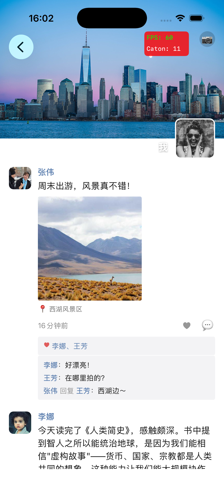
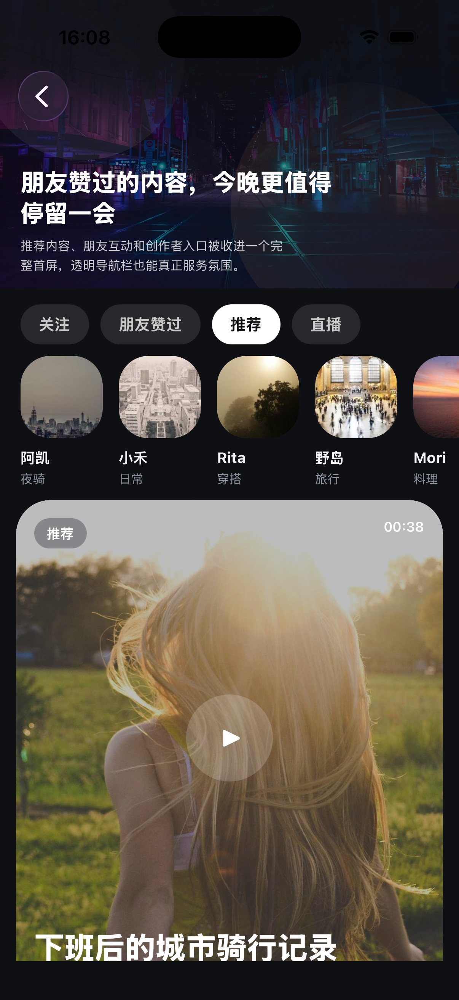
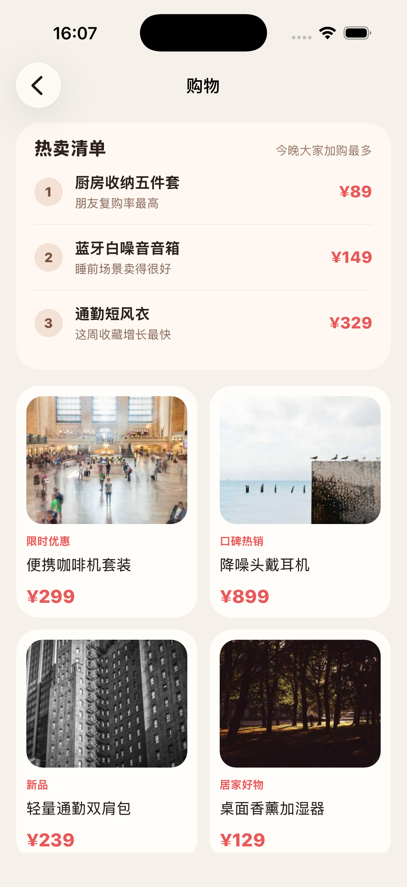
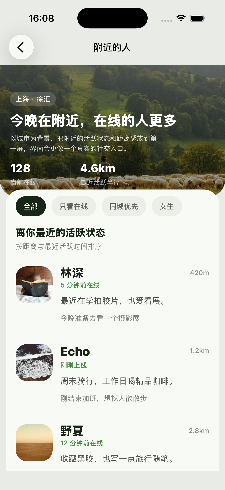
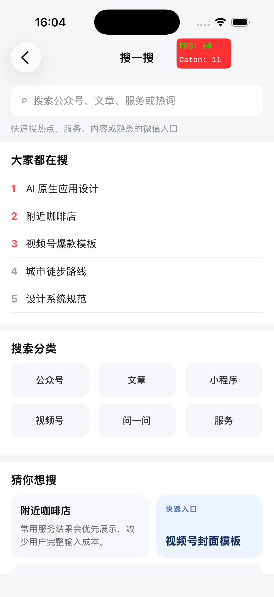
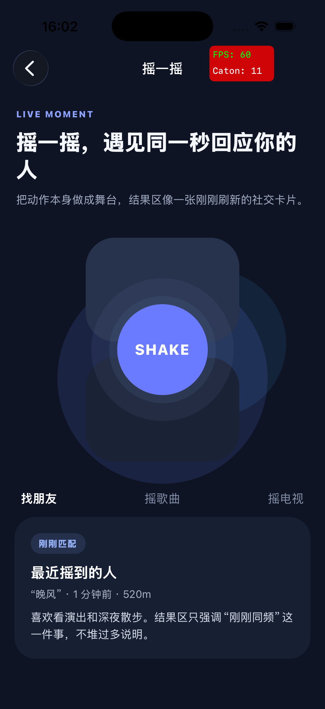

# WeChatRN

> 高仿微信项目的 **React Native 侧** —— 不是独立 App,而是**以「页面提供方」身份嵌入原生微信壳**:原生每个二级页面宿主一个 RN 页面,目前用 RN 实现了 **19 个页面**(朋友圈、视频号、通讯录系列等)。基于 **RN 0.84 新架构(Fabric + TurboModule)** + **TypeScript**,JS bundle 可走 OSS **热更新**。

## 与 StudyDemoSwift 的关系

本仓库是高仿微信项目的 **React Native 子系统**,**不独立运行**,而是嵌入原生 iOS 主工程 **StudyDemoSwift**(Swift / UIKit 实现的微信客户端):

- **StudyDemoSwift = 宿主壳**:负责底部 Tab、导航栈、IM、登录、各类原生能力(扫一扫、相册、网络、缓存…)
- **WeChatRN = 页面提供方**:主工程把「发现」下的二级页面(朋友圈、视频号、购物…)以 RN 形式交给本仓库渲染,通过 `RCTReactNativeFactory` + `pageName` 加载,双方以 **TurboModule 桥**通信

> 📦 **主工程仓库 / README**:👉 **[StudyDemoSwift](https://github.com/crunkzhang/StudyDemoSwift)**(原生 iOS,微信主体 + IM + 动态化引擎)

**同系列项目矩阵**:

| 仓库 | 角色 |
|---|---|
| [StudyDemoSwift](https://github.com/crunkzhang/StudyDemoSwift) | 原生 iOS 主工程(宿主壳 + IM + DSL 动态化) |
| **StudyDemoRN**(本仓库) | RN 子系统:发现/通讯录等二级页面 |
| [StudyDemoWebGames](https://github.com/crunkzhang/StudyDemoWebGames) | H5 游戏中心(OSS 热更) |

---

## 架构:原生壳 + RN 页面宿主

不走「RN 接管整个 App」的路子,而是 **一个原生页面 = 一个 RN 页面宿主**,做原生与 RN 的细粒度混合:

```
原生 (StudyDemoSwift)                       RN (本仓库)
┌─────────────────────────┐
│ 点「发现 → 朋友圈」        │  pageName="moments"   ┌──────────────────────────┐
│ 创建 RN 容器 VC           │  + params ──────────► │ index.js → AppRoot        │
│ (RCTReactNativeFactory)   │                       │  └ PageHost(pageName)     │
│                           │                       │     └ PageRegistry 查表    │
│ NavbarBridge/NetBridge…   │ ◄──── TurboModule ───►│        └ MomentsPage 渲染  │
└─────────────────────────┘                       └──────────────────────────┘
```

- **PageHost / PageRegistry / routes**(`src/app/navigation/`):原生传入 `pageName + params`,RN 据 `routes.ts` 注册表惰性 `require` 对应页面渲染;启动时强校验「有且仅有一个 `initPage`」。
- **一份 bundle、多页面复用**:同一 RN 实例按需渲染任意已注册页面。
- **热更新**:`bundle/ios/main.jsbundle` 产物上 OSS,原生加载远端 bundle,改 RN 不发版即更新。

---

## 主要页面

> 截图取自嵌入 StudyDemoSwift 后的真机运行(右上角为自带的卡顿监控浮层)。

### 🟢 朋友圈 Moments

<table><tr>
<td width="34%"></td>
<td>完整复刻朋友圈时间线:顶部封面图 + 头像,好友动态支持<b>图文 / 定位 / 时间</b>,点赞行与<b>嵌套评论(可回复某人)</b>。是嵌入式 RN 页里复杂度最高的一个 —— 覆盖列表性能、图文混排、评论浮层手势、与原生导航栏联动。技术实现见下文「旗舰页」。</td>
</tr></table>

### 📺 视频号 Video Channel

<table><tr>
<td width="34%"></td>
<td>深色沉浸式视频流:<b>关注 / 朋友赞过 / 推荐 / 直播</b> 分区切换,创作者头像横向滑动,视频卡片含封面、时长与播放态。还原视频号的内容编排与视觉氛围。</td>
</tr></table>

### 🛍️ 购物 Shopping

<table><tr>
<td width="34%"></td>
<td><b>热卖榜单</b>(Top3 排行 + 价格)+ 商品<b>瀑布流卡片</b>(限时优惠 / 口碑热销 / 新品角标),图片懒加载、价格高亮,典型电商列表布局。</td>
</tr></table>

### 📍 附近的人 Nearby

<table><tr>
<td width="34%"></td>
<td>场景头图 + <b>在线人数 / 距离</b>统计,筛选条(全部 / 只看在线 / 同城优先 / 女生),按距离排序的活跃用户列表(头像、距离、在线状态、签名)。</td>
</tr></table>

### 🔍 搜一搜 Search

<table><tr>
<td width="34%"></td>
<td>搜索框 + <b>热搜榜</b> + <b>搜索分类</b>(公众号 / 文章 / 小程序 / 视频号 / 问一问 / 服务)+「猜你想搜」+ 快捷入口,还原微信统一搜索入口的信息架构。</td>
</tr></table>

### 🎲 摇一摇 Shake

<table><tr>
<td width="34%"></td>
<td>深色主题大号 <b>SHAKE</b> 按钮 + <b>找朋友 / 摇歌曲 / 摇电视</b> 分区,「最近摇到的人」结果卡片,带交互动效的趣味页。</td>
</tr></table>

---

## 已接入的 RN 页面(19)

| 模块 | 页面 |
|---|---|
| **发现** | 朋友圈 `moments`、视频号 `videoChannel`、扫一扫 `scan`、摇一摇 `shake`、附近的人 `nearby`、购物 `shopping`、搜一搜 `search`、游戏中心 `gameCenter` / 游戏容器 `gameContainer` |
| **通讯录** | 新的朋友 `contactNewFriends`、群聊 `contactGroups`、标签 `contactTags` / 新建标签 `contactTagCreate`、公众号 `contactOfficialAccounts`、通讯录搜索 `contactSearch` |
| **聊天 / 我** | 聊天详情 `chat`、个人资料 `userProfile`、设置 `settings` |
| **调试** | RN Debug 首页 `debugHome`(默认入口页) |

---

## ⭐ 桥接层:类型安全的 TurboModule 双向桥

`src/shared/bridges/` 是工程亮点 —— 把原生能力以**强类型、分层**方式暴露给 RN,全部基于 **新架构 TurboModule(codegen)**:

```
bridges/
├── common/      # 通用桥(7)
│   ├── navbar/         导航栏(原生/RN 双模式、右键、外观)
│   ├── navigation/     页面跳转(push 原生 / RN 页)
│   ├── net/            网络(复用原生网络栈、统一鉴权)
│   ├── cache/          缓存读写
│   ├── toast/          轻提示
│   ├── device/         设备信息
│   └── permission/     权限申请
└── business/    # 业务桥
    └── scan/           扫一扫 + 相册选图
```

**分三层、职责清晰**(以 navbar 为例):
- `NativeNavbarBridge.ts` — `TurboModuleRegistry.getEnforcing<Spec>('NavbarBridge')`,codegen 原生绑定层
- `navbarBridge.ts` — JS 封装层,补默认值 / 收敛类型 / 友好 API
- `hooks/useNavbar.ts` — React 钩子层,页面里声明式调用

业务侧只认顶层 API 与 hooks,native 协议改动被 wrapper 层吸收,不外溢到页面。

---

## ⭐ 旗舰页:朋友圈(Moments)技术实现

`src/modules/discover/moments/` —— 上文那个朋友圈页的代码组织:

- **数据**:`Post` / `Comment` 模型、`momentsReq` 请求层、`mockData` 假数据
- **状态**:`useMoments`(列表 / 点赞 / 分页)、`useCommentInput`(评论输入态)
- **组件**:`ImageGrid`(九宫格图,单/多图自适应)、`LikeList`、`CommentInput`、`PostActionSheet`(点赞/评论浮层)、`VideoThumb`、图片查看器(`react-native-image-viewing`)

---

## 其它共享设施(`src/shared/`)

- **UI kit**(`ui/`):`PageScaffold` / `ScreenHeader` / `SearchBar` / `ListSection` / `ListCell` / `Avatar` / `EmptyState` / `icons` + 设计 token(`tokens.ts`)
- **事件总线**(`events/`):`EventBus` + `registry` + `useAppEvent`,跨页 / 原生事件订阅
- **网络**(`net/`):`http` 封装,经 `NetBridge` 复用原生网络栈
- **模型**(`models/`):`User` 等共享领域模型

---

## 目录结构

```
WeChatRN/
├── index.js / App.tsx        # 入口:AppRegistry → AppRoot → PageHost
├── src/
│   ├── app/navigation/       # PageHost · PageRegistry · routes · RouteParams
│   ├── modules/              # 业务页面(discover / contacts / chat / profile / debug)
│   └── shared/               # bridges · ui · events · net · models
├── bundle/ios/main.jsbundle  # 打包产物(上 OSS 热更)
├── screenshots/              # README 截图
├── ios/ · android/           # RN 原生工程(主要在 iOS 侧嵌入 StudyDemoSwift)
└── docs/
```

## 技术栈

- **React Native 0.84**(新架构:Fabric 渲染 + TurboModule)
- **TypeScript**(全量类型)
- `@react-navigation/native` · `react-native-screens` · `react-native-safe-area-context`
- `react-native-svg` · `react-native-webview` · `react-native-image-viewing`
- Jest 单测、ESLint + Prettier

---

## 开发

```sh
# 启动 Metro
yarn start

# 跑 iOS 自测(首次先 cd ios && bundle install && bundle exec pod install)
yarn ios

# 打离线 bundle(供原生 / OSS 热更)
npx react-native bundle --platform ios --dev false \
  --entry-file index.js --bundle-output bundle/ios/main.jsbundle
```

> 真实运行形态是被 **[StudyDemoSwift](https://github.com/crunkzhang/StudyDemoSwift)** 通过 `RCTReactNativeFactory` 加载、按 `pageName` 渲染对应页面;独立 `yarn ios` 仅用于 RN 侧自测(默认进 `debugHome`)。

---

*StudyDemoSwift 高仿微信项目的 React Native 子工程,聚焦「原生壳 + RN 页面宿主」的混合开发与 TurboModule 桥接。*
